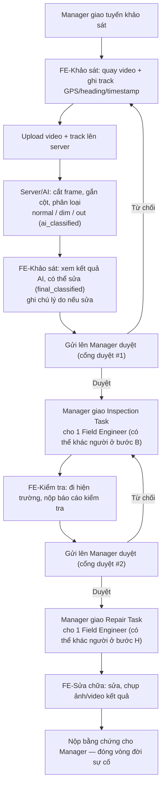

# LuxMap Mobile — Luồng hoạt động chi tiết (v1.0, cập nhật 2026-09-25)

> File này mô tả **luồng hoạt động thực tế** của app Mobile (Field Operations) sau khi đã cập nhật quyết định nghiệp vụ chốt ngày 2026-09-25 (xem `CLAUDE.md` mục "Quyết định nghiệp vụ mới đã chốt" và mục **C6** trong `LuxMap_Mobile_DacTaChiTiet_v2.2.docx`).
>
> Mục đích: để bất kỳ ai trong nhóm (dev mới vào, QA, hoặc thành viên khác) đọc 1 file này là hình dung được toàn bộ vòng đời một sự cố đèn đường — từ lúc khảo sát tới lúc sửa xong — mà không cần đọc lại toàn bộ đặc tả chi tiết.
>
> Phần nào **còn là khoảng trống chưa chốt** (chưa có tên bảng/field/endpoint chính thức) được đánh dấu rõ — không dùng các phần đó làm căn cứ để code, phải xác nhận lại với WP2/WP5 trước.

---

## 0. Vai trò liên quan

App Mobile chỉ phục vụ **duy nhất 1 vai trò: Field Engineer** (Tổ khảo sát/sửa chữa). Nhưng luồng hoạt động đầu-cuối có sự tham gia của các vai trò khác qua **Web GIS** (ngoài phạm vi repo này):

| Vai trò | Nền tảng | Vai trò trong luồng dưới đây |
|---|---|---|
| **Field Engineer** | Mobile (repo này) | Khảo sát, kiểm tra hiện trường, sửa chữa — có thể là 3 người khác nhau cho 3 giai đoạn của cùng 1 sự cố |
| **Manager** (Kỹ sư bảo trì) | Web GIS | Duyệt kết quả khảo sát, duyệt báo cáo kiểm tra, giao việc (Inspection Task / Repair Task) |
| **AI / Server (CV-Analytics)** | Backend | Cắt frame từ video, gắn cột, phân loại `normal/dim/out` |
| **Citizen** | Quét QR (ngoài phạm vi Mobile) | Nguồn sự cố ngoại lệ khác, không liên quan trực tiếp tới luồng dưới đây |
| **Superior, System Admin** | Web GIS | Không tham gia luồng vận hành hằng ngày này |

---

## 1. Tổng quan vòng đời một sự cố đèn đường

**Điểm quan trọng:** 3 ô "FE-..." ở trên **không bắt buộc là cùng một người**. Mobile phải xử lý được trường hợp một Field Engineer đăng nhập chỉ thấy đúng phần việc được giao cho mình (khảo sát, hoặc kiểm tra, hoặc sửa chữa), không phải toàn bộ vòng đời.

---

## 2. Chi tiết từng bước

### 2.1. Manager giao tuyến khảo sát

- Field Engineer đăng nhập (F01), thấy tuyến khảo sát được giao trong "Việc hôm nay" (F02).
- Không đổi so với đặc tả hiện tại (F01–F02).

### 2.2. Khảo sát — quay video thay vì chụp ảnh rời (ĐÃ ĐỔI so với F03/F04 hiện tại)

- FE lập kế hoạch tuyến (F03) — checklist bắt buộc trước khi bắt đầu vẫn giữ nguyên nguyên tắc: **chặn cứng nếu chưa khoá exposure**, không chỉ nhắc nhở.
- Khi bắt đầu khảo sát (F04 — Capture Mode):
  - Thiết bị **quay video liên tục**, khoá exposure áp dụng cho **cả phiên quay**, không phải 1 lần chụp.
  - Đồng thời, **ghi liên tục 1 track GPS + heading + timestamp** trong suốt thời gian quay (không phải 1 GPS fix cho mỗi ảnh như model `local_survey_frame` cũ).
  - Không chụp ảnh rời (`SurveyFrame`) như đặc tả F04 mô tả hiện tại.
- Kiểm tra độ phủ (F05), nộp đợt khảo sát (F06), nhập lux đối chứng nếu là đợt đối chứng (F07) — 3 màn này **không đổi về mặt UI/nguyên tắc offline-first**, chỉ đổi loại dữ liệu được nộp (video + track thay vì tập ảnh).
- **Mobile chỉ có nhiệm vụ quay + ghi track + upload cả hai lên server — không tự cắt frame, không cần thêm thư viện xử lý video.**

### 2.3. Server/AI xử lý (ngoài phạm vi Mobile)

- Server cắt frame từ video, khớp từng frame với mốc GPS/timestamp gần nhất trong track đã upload.
- AI phân loại từng cột đèn: `normal` / `dim` / `out` → đây là `ai_classified`, **gốc, không được ghi đè trực tiếp**.

### 2.4. Field Engineer xem & có thể sửa kết quả AI (MỚI — chưa có trong đặc tả F04–F07 hiện tại)

- FE (thường là người vừa khảo sát) xem danh sách cột đã được AI phân loại.
- Có thể **sửa** phân loại nếu thấy sai, kèm **ghi chú lý do sửa**.
- Đây là bước duyệt sơ bộ tại hiện trường — **không phải Manager duyệt**.
- Kết quả sau khi FE xem/sửa là `final_classified` — **tách biệt hoàn toàn khỏi `ai_classified`**, kèm audit trail: có sửa hay không, sửa từ giá trị gì thành giá trị gì, sửa lúc nào, bởi ai. Đây là dữ liệu phục vụ trực tiếp RQ1 (đối chiếu độ chính xác AI với con người), **không được phép mất bản gốc AI**.

### 2.5. Gửi lên Manager duyệt — Cổng duyệt #1

- FE gửi kết quả (đã xem/sửa) lên Manager.
- Manager duyệt trên Web GIS (ngoài phạm vi Mobile).
- Nếu duyệt → tạo **Inspection Task**, giao cho 1 Field Engineer (có thể là người khác).
- Nếu từ chối → quay lại bước khảo sát (chi tiết luồng "khảo sát lại" khi bị từ chối **vẫn là khoảng trống thật**, xem mục 4 bên dưới).

### 2.6. Inspection Task — Field Engineer kiểm tra hiện trường (MỚI, thay thế 1 phần F08–F10 hiện tại)

- Field Engineer được giao Inspection Task thấy nó trong danh sách việc của mình (tương đương F08 hiện tại, nhưng cần phân biệt được đây là **loại việc kiểm tra**, không phải sửa chữa).
- Đi tới hiện trường (điều hướng — tương đương F09).
- Nộp báo cáo kiểm tra (chưa có tên field/entity chính thức — xem mục 4).
- Gửi lên Manager duyệt — **Cổng duyệt #2**.

### 2.7. Repair Task — Field Engineer sửa chữa (MỚI, thay thế 1 phần F08–F10 hiện tại)

- Sau khi Manager duyệt báo cáo kiểm tra, tạo **Repair Task**, giao cho 1 Field Engineer (có thể là người thứ ba trong toàn bộ vòng đời).
- FE sửa chữa, **bắt buộc có ảnh sau + ghi chú kết quả** trước khi đóng việc (nguyên tắc cũ ở F10 vẫn giữ nguyên, chỉ đổi tên thực thể từ "WorkOrder liền mạch" sang "Repair Task").
- Nộp ảnh/video kết quả cho Manager — kết thúc vòng đời sự cố.

---

## 3. Những phần KHÔNG đổi so với đặc tả hiện tại

- **F01 Đăng nhập, F02 Việc hôm nay, F03 checklist khoá exposure**: giữ nguyên nguyên tắc, chỉ khác ở chỗ F04 quay video thay vì chụp ảnh.
- **F11 Báo cáo sự cố tại hiện trường (`field_report`)**: một Field Engineer phát hiện sự cố ngoài tuyến được giao vẫn báo cáo qua F11 như cũ — đây là nguồn `Fault` ngoại lệ, độc lập với luồng khảo sát/Inspection/Repair Task ở trên.
- **F12 Bản đồ hiện trường, F13 Hàng đợi đồng bộ, F15 Cá nhân**: không đổi.
- **Nguyên tắc offline-first**: mọi bước thao tác chính (quay video, ghi track, xem/sửa phân loại AI, nộp báo cáo kiểm tra, cập nhật Repair Task) đều phải ghi Room trước, đẩy vào `sync_queue`, không chờ mạng — không có ngoại lệ cho luồng mới này.
- **Không tự động ghi đè khi xung đột đồng bộ (409)**: áp dụng cho cả dữ liệu Inspection/Repair Task.

---

## 4. Khoảng trống chưa chốt — KHÔNG tự đoán khi code

| Phần | Tình trạng |
|---|---|
| Tên bảng/field cho `ai_classified` / `final_classified` / audit trail | Đã chốt về nghiệp vụ (mục 2.4), **chưa có tên bảng/field/endpoint chính thức** — chờ WP2/WP5 |
| Entity `InspectionTask` / `RepairTask` (hoặc mở rộng `WorkOrder`) | Đã chốt là 2 giai đoạn tách biệt (mục 2.6–2.7), **chưa chốt có tách hẳn entity hay không** — chờ WP2/WP5 |
| Bảng lưu track GPS/heading/timestamp liên tục (thay/thêm cạnh `local_survey_frame`) | Chưa có tên bảng chính thức — chờ WP2/WP5 |
| Luồng khảo sát/báo cáo kiểm tra **bị Manager từ chối** (cổng duyệt #1 hoặc #2) | Chưa có trạng thái/API cho việc "khảo sát lại" hay "kiểm tra lại" — xem thêm mục "Khoảng trống đã biết" trong `CLAUDE.md` |
| F14 Thông báo (`notification`) | Vẫn là khoảng trống thật, chưa có trong `api-contract-v1.1.md.docx` |
| F07 Nhập lux | **Đã chốt**, không phải khoảng trống — xem `api-contract-v1.1.md.docx` mục 2.9 (BE-42) |
| Cảm biến lux qua BLE trong phiên quay (F03/F04) | **Mới phát sinh 2026-09-27** (`docs/nghiep_vu_khao_sat_den.docx`), sau khi file này đã lập (2026-09-25) — chưa có ở đây, chưa có ở `docs/Backend_API_Requirements_For_Mobile.docx`. Có vẻ mâu thuẫn với mô hình `iot_node` cố định lắp tại cột (báo cáo độc lập lên server, không qua điện thoại FE) đã mô tả ở `Backend_API_Requirements_For_Mobile.docx` mục 2.1. Chưa xác nhận là 1 nguồn dữ liệu thứ 3 thật hay chỉ diễn đạt lại luồng IoT cố định — xem `CLAUDE.md` mục "Khoảng trống đã biết" |

**Trước khi code lại F03/F04/F08–F10 hoặc bất kỳ phần nào ở mục 2.4–2.7:** xác nhận field/entity/endpoint thật với WP2/WP5, cập nhật `LuxMap_Mobile_DacTaChiTiet_v2.2.docx` và `api-contract-v1.1.md.docx` trước — không tự đặt tên bảng/field.

---

## 5. Tham chiếu

- `CLAUDE.md` — mục "Quyết định nghiệp vụ mới đã chốt (2026-09-25)" và "Khoảng trống đã biết"
- `docs/LuxMap_Mobile_DacTaChiTiet_v2.2.docx` — mục **C6** (bổ sung 2026-09-25), C4, F04, F08–F10 (bản cũ, đã gắn ghi chú trỏ sang C6)
- `docs/api-contract-v1.1.md.docx` — mục 2.8 (BE-41, `POST /api/v1/faults`), 2.9 (BE-42, lux-readings)
- `docs/FA26SE222 v1.2.docx` — mục 3.2.c, mô tả gốc luồng Manager review/accept/reject và Field Engineer re-survey
- `docs/Backend_API_Requirements_For_Mobile.docx` (2026-09-25) — đối chiếu trực tiếp từ source code backend, chốt endpoint nào code được ngay vs còn cần WP2/WP5 quyết
- `docs/nghiep_vu_khao_sat_den.docx` (2026-09-27) — luồng thu thập dữ liệu khảo sát chi tiết hơn (video + GPS track + cảm biến lux BLE), thêm nguồn BLE chưa đối chiếu — xem mục 4
